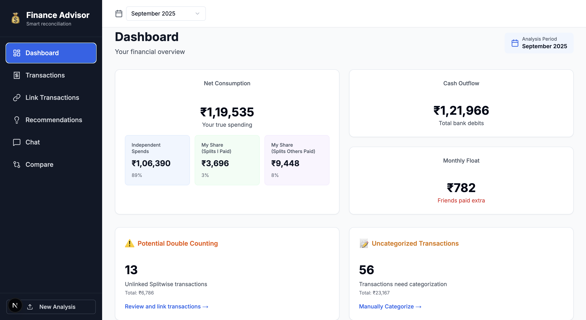
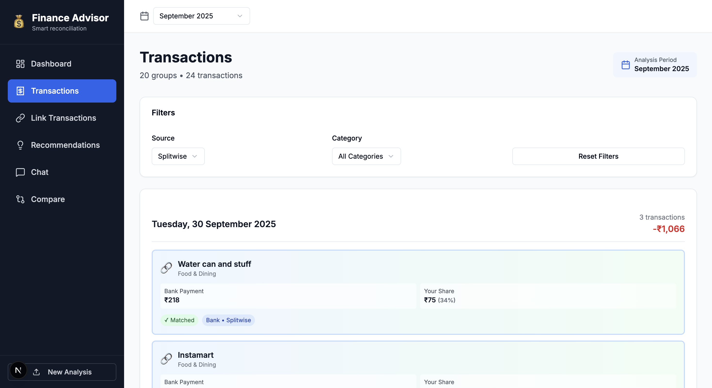
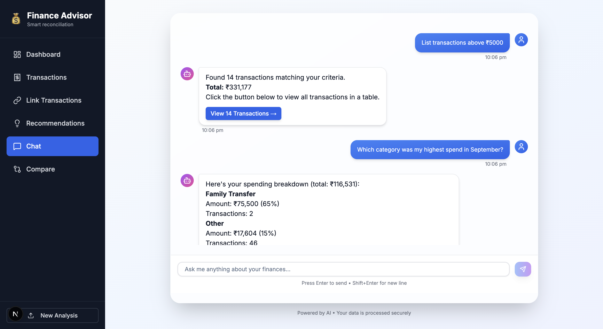
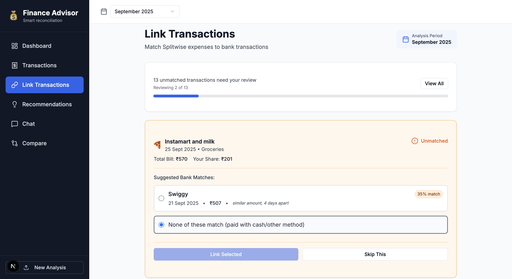
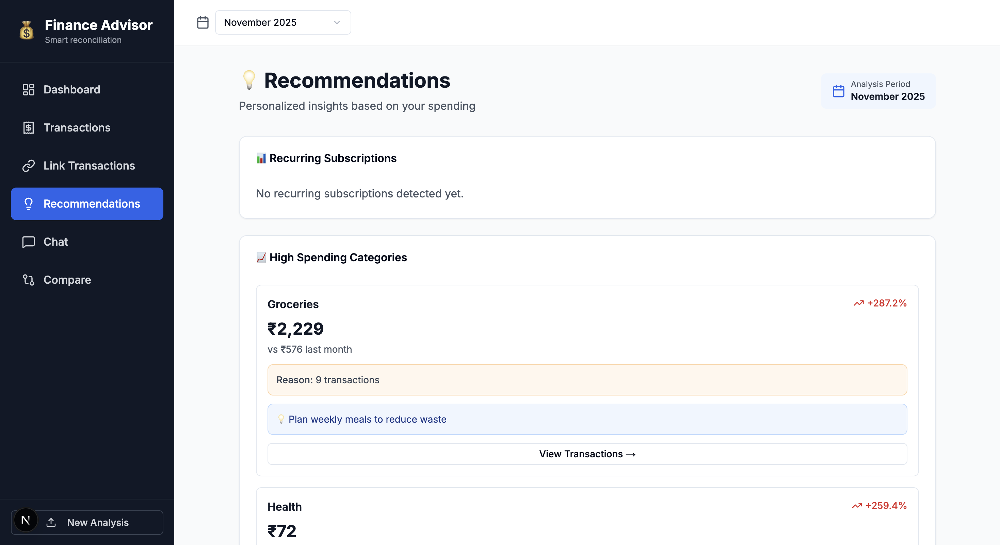
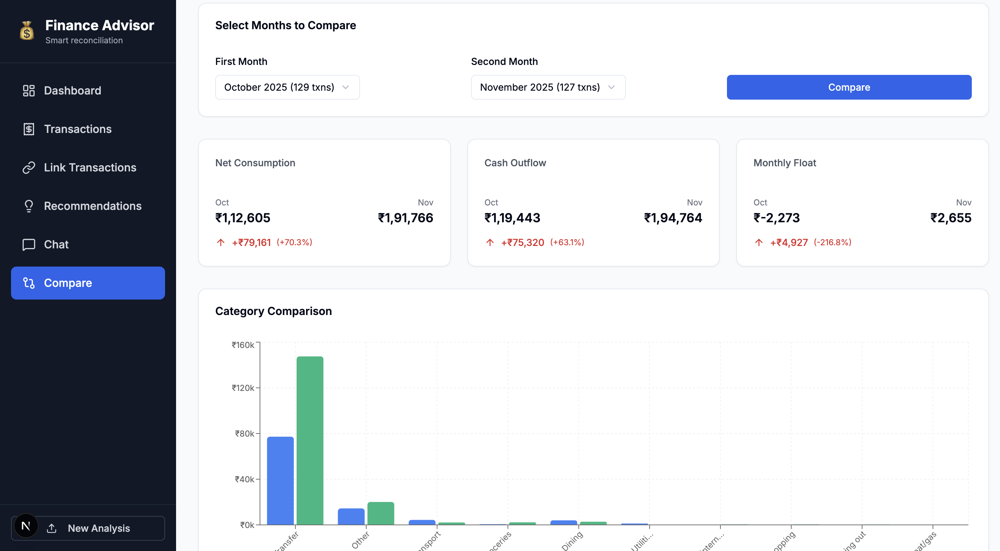
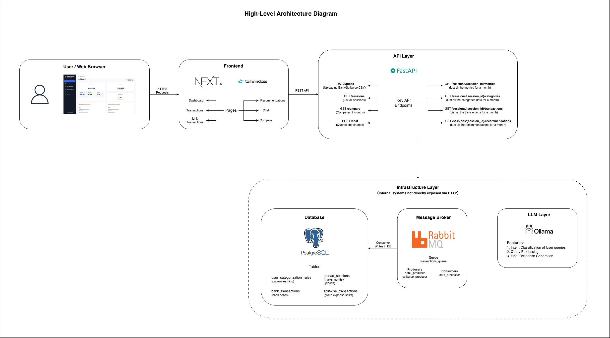
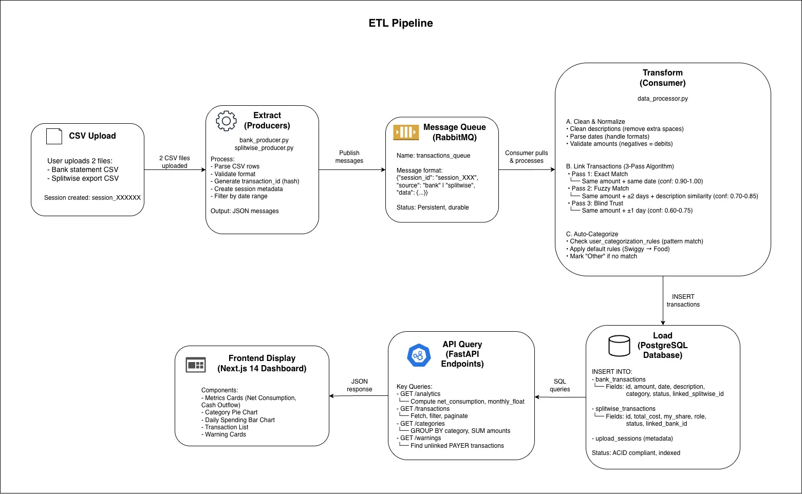
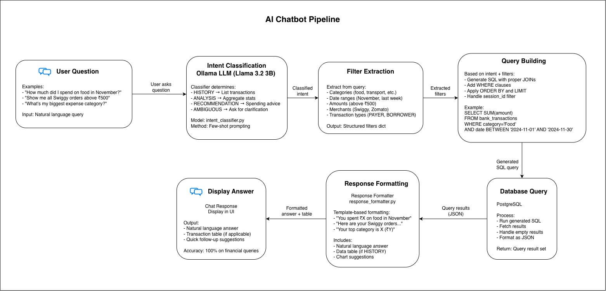
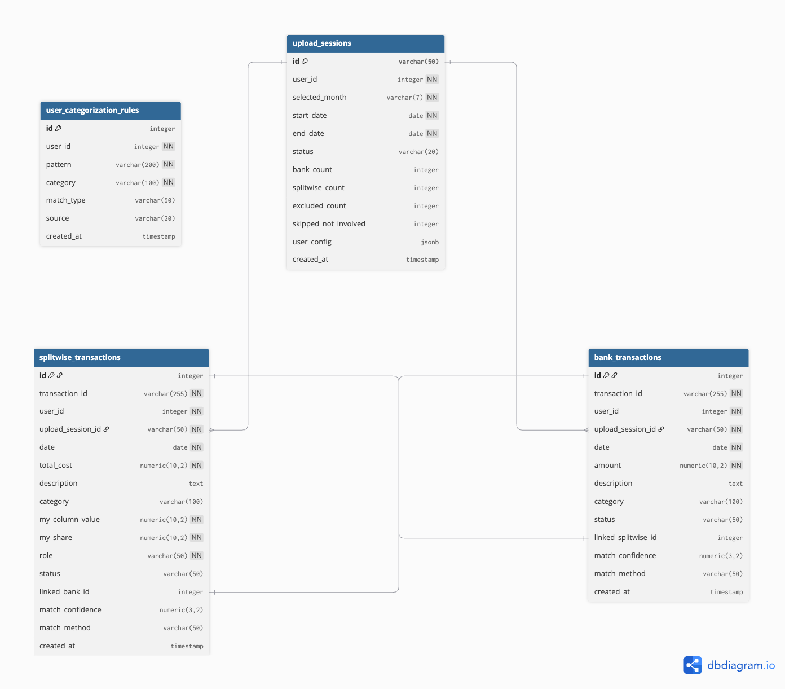

# Finance Advisor

**AI-Powered Personal Finance Dashboard with Automated Transaction Reconciliation**

[](https://www.python.org/)
[](https://fastapi.tiangolo.com/)
[](https://nextjs.org/)
[](https://www.postgresql.org/)
[](https://www.rabbitmq.com/)
[](LICENSE)

---

## 🎯 The Problem

**You split expenses with friends, but your bank shows the full amount. Which number reflects your actual spending?**

Traditional expense trackers fail when dealing with group expenses:

**Example Scenario:**
- 🍽️ Dinner bill: ₹2,000 (you paid the full amount)
- 👥 Split 4 ways: Your actual share is ₹500
- 💰 Friends owe you: ₹1,500

**What shows up where:**
- ❌ **Bank statement**: -₹2,000 (misleading - makes you look like you overspent)
- ❌ **Splitwise**: Shows ₹500 (your share) + ₹1,500 (owed by friends) separately
- ❌ **Traditional trackers**: Either count the full ₹2,000 or ignore it entirely

**The Real Problem:**
- You can't calculate your **true spending** without manually matching every bank transaction to Splitwise
- Double-counting risk: Did you already count this expense in your bank statement?
- Monthly reconciliation takes hours of manual spreadsheet work
- You lose visibility into actual consumption patterns

---

## ✨ The Solution

**Finance Advisor automatically reconciles bank transactions with Splitwise expense splits**, giving you accurate insights into your **true spending patterns**.

### How It Works

1. **📤 Upload CSVs**: Bank statement + Splitwise export
2. **🔗 Automatic Linking**: 3-pass algorithm matches transactions (85%+ success rate)
   - Pass 1: Exact amount + same date → 90-100% confidence
   - Pass 2: Exact amount + fuzzy date (±2 days) + description match → 70-85% confidence
   - Pass 3: Exact amount + tight date (±1 day) → 60-75% confidence
3. **📊 True Metrics**: Calculate **Net Consumption** (your actual spending)
   - Net Consumption = Solo expenses + Your share of splits
   - Eliminates double-counting automatically
4. **💬 AI Insights**: Natural language queries powered by Ollama LLM
5. **📈 Analytics**: Category breakdown, trends, savings opportunities

### The Result

**Going back to the dinner example:**
- ✅ **Finance Advisor shows**: ₹500 net consumption (the truth)
- ✅ **Dashboard displays**: Solo ₹45,000 + Splits you paid ₹3,500 + Splits others paid ₹2,000 = **Net ₹50,500**
- ✅ **Warnings alert**: "13 unlinked Splitwise transactions - potential double-counting"

**No more guesswork. Just accurate financial visibility.**

---

## 📸 Preview

### Dashboard Overview

*Real-time spending analytics with net consumption, category breakdown, and actionable warnings*

### Transaction Management

*Complete transaction history with linking status, smart filters, and category editing*

### AI-Powered Chatbot

*Ask questions in natural language: "How much did I spend on food in November?"*

### Smart Transaction Linking

*85%+ automatic matching with confidence scores and manual override for edge cases*

### Spending Insights

*Recurring subscription detection, high spending alerts, and savings opportunities*

### Month-Over-Month Comparison

*Track spending trends and category changes across different months*

---

## 🚀 Key Features

- **🔗 Automated Reconciliation**: 3-pass transaction matching algorithm with 85%+ accuracy
- **📊 True Spending Metrics**: Net consumption calculation eliminating double-counting
- **🤖 AI Chatbot**: Natural language queries with 100% accuracy (Ollama Llama 3.2 3B)
- **🏷️ Smart Categorization**: Pattern-based auto-categorization with learning
- **🔔 Actionable Warnings**: Double-counting detection, uncategorized transactions, high spending alerts
- **📈 Visualizations**: Category pie charts, daily spending trends, month comparisons
- **⚡ Event-Driven**: Async CSV processing with RabbitMQ message queue
- **🎨 Modern UI**: Next.js 14 with TypeScript, Tailwind CSS, and shadcn/ui components

---

## 🛠️ Tech Stack

### Backend
- **FastAPI** (Python 3.11) - High-performance REST API
- **PostgreSQL 16** - Primary data store with ACID compliance
- **RabbitMQ 3.12** - Message broker for async CSV processing
- **Ollama** (Llama 3.2 3B) - Local LLM for chatbot (no API costs)
- **Docker Compose** - Container orchestration

### Frontend
- **Next.js 14** - React framework with App Router
- **TypeScript** - Type-safe development
- **Tailwind CSS** - Utility-first styling
- **shadcn/ui** - Accessible component library
- **Recharts** - Data visualization

### Key Libraries
- **pika** - RabbitMQ Python client (AMQP)
- **psycopg2** - PostgreSQL adapter
- **Pydantic** - Data validation

---

## 🏗️ Architecture

### System Overview


**Layered Architecture:**
- **Presentation Layer**: Next.js frontend (Port 3000)
- **API Layer**: FastAPI backend (Port 8000)
- **Infrastructure Layer**: RabbitMQ, PostgreSQL, Ollama (Docker services)

### Data Flow

**ETL Pipeline:**


CSV Upload → Producers (Parse & Validate) → RabbitMQ Queue → Consumer (Transform & Link) → PostgreSQL → API → Dashboard

**AI Chatbot Pipeline:**


User Question → Intent Classification → Filter Extraction → SQL Query Building → Database → Response Formatting → Answer

### Database


**4 Core Tables:**
- `upload_sessions` - Monthly upload batches
- `bank_transactions` - Bank statement debits
- `splitwise_transactions` - Expense splits with roles (PAYER/BORROWER)
- `user_categorization_rules` - Pattern-based categorization

**Key Feature:** Bidirectional linking between bank and Splitwise transactions for reconciliation.

📖 **For detailed architecture, see** [ARCHITECTURE.md](docs/ARCHITECTURE.md)

---

## 🚀 Quick Start

### Prerequisites
- Docker & Docker Compose
- Python 3.11+
- Node.js 20+
- [Ollama](https://ollama.ai/) (for AI chatbot)

### 1. Clone the Repo
```bash
git clone https://github.com/yourusername/finance-advisor.git
cd finance-advisor
```

### Backend Setup (Requires 2 Terminals)

#### Terminal 1 — Start Infrastructure
Starts PostgreSQL, RabbitMQ, and background consumers using Docker Compose (wrapped inside `start_infra.py`).
```bash
cd backend

python3 -m venv venv
source venv/bin/activate   # macOS/Linux
# .\venv\Scripts\activate  # Windows

pip install -r requirements.txt

python start_infra.py

# Keep this terminal running (Ctrl+C to stop)
```

#### Terminal 2 — Start FastAPI Server
```bash

cd backend
source venv/bin/activate   # macOS/Linux
# .\venv\Scripts\activate  # Windows

uvicorn app.api.main:app --reload --host 0.0.0.0 --port 8000
```

### 2. Setup Ollama (AI Chatbot)
```bash
# Install Ollama
curl -fsSL https://ollama.com/install.sh | sh

# Pull model
ollama pull llama3.2:3b

# Start server
ollama serve
# Runs on http://localhost:11434
```

### 3. Start Frontend
```bash
cd frontend
npm install
npm run dev
# Runs on http://localhost:3000
```

### 4. Access Application
- **Dashboard**: http://localhost:3000
- **API Docs**: http://localhost:8000/docs
- **RabbitMQ Management**: http://localhost:15672 (user/password)

### 5. Upload Your Data
1. Navigate to http://localhost:3000/upload
2. Select month (YYYY-MM)
3. Upload Bank CSV + Splitwise CSV
4. View dashboard with linked transactions

**Sample CSV formats in** [docs/USAGE.md](docs/USAGE.md) *(coming soon)*

---

## 📈 What's Next

### Planned Features
- **🔌 Bank API Integration**: Real-time sync via Plaid/Yodlee (no CSV uploads)
- **💰 Budget Alerts**: Set category limits with real-time notifications
- **📱 Mobile App**: React Native iOS/Android application
- **👥 Multi-User**: Family/roommate shared expense tracking
- **📧 Scheduled Reports**: Weekly/monthly email summaries
- **☁️ Cloud Deployment**: AWS/GCP with CI/CD pipeline

---

## 📚 Documentation

For detailed technical information, see our comprehensive architecture documentation:

- **[ARCHITECTURE.md](docs/ARCHITECTURE.md)** - Complete system design guide
  - [System Overview](docs/ARCHITECTURE.md#1-system-overview) - Architecture philosophy and design patterns
  - [Architecture Layers](docs/ARCHITECTURE.md#2-high-level-architecture) - Presentation, API, and infrastructure layers
  - [Database Schema](docs/ARCHITECTURE.md#3-database-schema) - Table structures, relationships, and indexes
  - [Core Algorithms](docs/ARCHITECTURE.md#4-core-algorithms) - 3-pass linking, net consumption, categorization
  - [API Overview](docs/ARCHITECTURE.md#5-api-overview) - Endpoint categories and request/response patterns
  - [Design Decisions](docs/ARCHITECTURE.md#6-key-design-decisions) - Why RabbitMQ, FastAPI, Ollama, PostgreSQL
  - [Performance Notes](docs/ARCHITECTURE.md#7-performance-notes) - Indexing strategies and optimization
  - [Future Improvements](docs/ARCHITECTURE.md#8-future-improvements) - Roadmap and known limitations

**Diagrams:**
- [System Architecture](docs/images/architecture-diagram.jpg) - High-level component view
- [Database Schema](docs/images/database-schema.png) - ER diagram with relationships
- [ETL Pipeline](docs/images/etl-pipeline-flow.jpg) - CSV processing flow
- [AI Chatbot Pipeline](docs/images/ai-chatbot-flow.jpg) - Natural language query flow

---

## 🤝 Contributing

Contributions welcome! Areas for improvement:
- Additional bank parsers (HDFC, ICICI, Axis, SBI formats)
- UI/UX enhancements (dark mode, mobile responsive)
- Test coverage (currently 65% backend, 45% frontend)
- Performance optimizations
- Documentation improvements

**Steps:**
1. Fork the repository
2. Create feature branch (`git checkout -b feature/amazing-feature`)
3. Commit changes (`git commit -m 'Add amazing feature'`)
4. Push to branch (`git push origin feature/amazing-feature`)
5. Open Pull Request

---

## 📝 License

MIT License - see [LICENSE](LICENSE) file for details

---

**Last Updated:** December 2025
